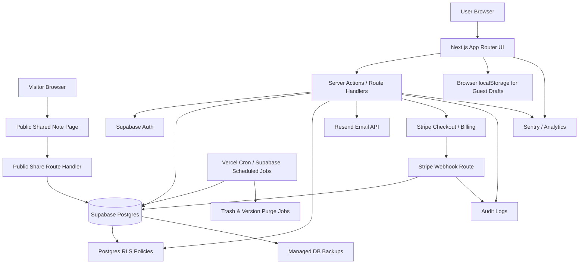

# System Architecture Blueprint — Minote

## 1. Recommended Tech Stack

เป้าหมายของ stack นี้คือให้ solo developer พัฒนาได้เร็ว ลดจำนวนระบบที่ต้องดูแลเอง และยังรองรับการ scale ในระดับ product จริง

| Layer | Recommendation | Reason |
|---|---|---|
| Frontend & Backend | Next.js App Router + TypeScript | Full-stack framework เดียว ทำ UI, route handlers, server actions และ SSR ได้ในโปรเจกต์เดียว |
| Styling | Tailwind CSS + shadcn/ui | ทำ UI ได้เร็ว คุม design system ง่าย และเหมาะกับ MVP ที่ต้อง polished |
| Database | Supabase Postgres | Relational data เหมาะกับ notes, subscription, share links, audit logs และ query ด้วย SQL ได้ชัดเจน |
| Auth | Supabase Auth | รองรับ Magic Link, OAuth, session management และทำงานกับ RLS ได้ดี |
| Authorization | Supabase Row Level Security | บังคับ owner-based access control ที่ database layer |
| File/Export Storage | Supabase Storage หรือ object storage ภายหลัง | ใช้เก็บ export file หรือ asset ใน Phase 2 |
| Payment | Stripe Billing | รองรับ subscription lifecycle, checkout, customer portal และ webhook ได้ครบกว่า PromptPay recurring |
| Email | Resend | ใช้ส่ง transactional email และสามารถใช้ custom SMTP กับ auth provider ได้ |
| Deployment | Vercel | เหมาะกับ Next.js, preview deployment ง่าย, scale ได้เร็ว |
| Background Jobs | Vercel Cron หรือ Supabase Scheduled Jobs | ใช้ purge trash, purge version history, subscription cleanup |
| Monitoring | Sentry + Vercel Analytics/Logs | ตรวจ error, performance และ production failures |
| Markdown Rendering | react-markdown + rehype-sanitize | Render note safely และลด XSS risk |
| Validation | Zod | Validate input ทั้ง client/server อย่างเป็นระบบ |

### Architecture Decision

* ใช้ **modular monolith** บน Next.js ก่อน ไม่แยก microservices ใน MVP
* ใช้ **Postgres เป็น source of truth**
* ใช้ **RLS เป็น security boundary หลัก** สำหรับข้อมูลผู้ใช้
* ใช้ **Route Handlers/Server Actions** สำหรับ business logic ที่ต้องตรวจ entitlement, quota และ audit
* ใช้ **Stripe webhook แบบ idempotent** เพื่อ sync subscription state
* sync profile-level subscription snapshot (`tier`, `stripe_customer_id`, `stripe_subscription_status`, `current_period_end`) ควบคู่กับ `subscriptions` เพื่อให้ middleware/UI gating อ่านได้เร็ว
* ใช้ **localStorage เฉพาะ Guest Mode** ไม่ใช้เป็น source of truth หลัง login

## 2. System Architecture Diagram



## 3. Database Schema Blueprint

### 3.1 `profiles`

เก็บข้อมูล public/internal profile ที่ผูกกับ Supabase auth user

| Field | Type | Key | Notes |
|---|---|---|---|
| id | uuid | PK/FK auth.users.id | user id จาก auth provider |
| email | text | unique | normalized lowercase |
| display_name | text | nullable | ชื่อที่แสดง |
| avatar_url | text | nullable | จาก OAuth |
| role | text | indexed | `user`, `admin` |
| tier | text | indexed | `free`, `pro`, `studio` snapshot สำหรับ gating เร็ว |
| stripe_customer_id | text | indexed nullable | profile-level Stripe customer snapshot |
| stripe_subscription_status | text | nullable | latest synced Stripe status |
| current_period_end | timestamptz | nullable | latest synced renewal/end date |
| created_at | timestamptz | | |
| updated_at | timestamptz | | |
| deleted_at | timestamptz | nullable | soft delete account |

### 3.2 `plans`

| Field | Type | Key | Notes |
|---|---|---|---|
| id | text | PK | `free`, `premium_monthly`, `premium_yearly`, `studio_monthly`, `studio_yearly` |
| name | text | | |
| tier | text | | `free`, `pro`, `studio` |
| billing_interval | text | | `forever`, `monthly`, `yearly` |
| note_limit | integer | | จำนวน note รวม |
| daily_create_limit | integer | | จำนวน note ใหม่ต่อวัน |
| monthly_price_usd_cents | integer | nullable | ราคาแบบ monthly เป็น cents |
| yearly_price_usd_cents | integer | nullable | ราคาแบบ yearly เป็น cents |
| max_tags_per_note | integer | nullable | `null` = unlimited |
| version_retention_days | integer | | 0 สำหรับ Free |
| can_password_share | boolean | | |
| can_customize_share | boolean | | |
| can_use_lora_share_font | boolean | | เปิด typography แบบ Lora |
| can_hide_share_branding | boolean | | Studio whitelabel |
| can_hide_share_metadata | boolean | | Studio shared view controls |
| can_use_advanced_focus | boolean | | Pro/Studio focus mode gating |
| can_access_priority_support | boolean | | Studio support routing |
| phase2_pdf_export_ready | boolean | | placeholder flag |
| phase2_version_history_ready | boolean | | placeholder flag |
| phase2_password_share_ready | boolean | | placeholder flag |
| phase2_share_expiration_ready | boolean | | placeholder flag |
| created_at | timestamptz | | |

### 3.3 `subscriptions`

| Field | Type | Key | Notes |
|---|---|---|---|
| id | uuid | PK | |
| user_id | uuid | FK profiles.id | owner |
| plan_id | text | FK plans.id | current plan |
| provider | text | | `stripe` |
| provider_customer_id | text | indexed | Stripe customer id |
| provider_subscription_id | text | unique nullable | Stripe subscription id |
| status | text | indexed | `active`, `trialing`, `past_due`, `canceled`, `expired`, `unpaid`, `payment_failed`, `refunded` |
| current_period_start | timestamptz | nullable | |
| current_period_end | timestamptz | nullable | |
| cancel_at_period_end | boolean | default false | |
| grace_until | timestamptz | nullable | |
| created_at | timestamptz | | |
| updated_at | timestamptz | | |

### 3.4 `notes`

| Field | Type | Key | Notes |
|---|---|---|---|
| id | uuid | PK | |
| user_id | uuid | FK profiles.id, indexed | owner |
| title | text | indexed | |
| content_markdown | text | | raw markdown/plain content |
| content_text | text | indexed | search-friendly plain text |
| status | text | indexed | `active`, `trashed`, `deleted` |
| revision | integer | | optimistic locking |
| trashed_at | timestamptz | nullable | |
| delete_after | timestamptz | nullable | default trashed_at + 30 days |
| last_saved_at | timestamptz | | |
| created_at | timestamptz | | |
| updated_at | timestamptz | indexed | |

Relationships:

* `profiles.id` 1:N `notes.user_id`
* RLS: user อ่าน/เขียนได้เฉพาะ note ของตัวเอง

### 3.5 `tags`

| Field | Type | Key | Notes |
|---|---|---|---|
| id | uuid | PK | |
| user_id | uuid | FK profiles.id, indexed | owner |
| name | text | | original display |
| normalized_name | text | indexed | trim/lowercase |
| created_at | timestamptz | | |

Constraint:

* unique `(user_id, normalized_name)`

### 3.6 `note_tags`

| Field | Type | Key | Notes |
|---|---|---|---|
| note_id | uuid | PK/FK notes.id | |
| tag_id | uuid | PK/FK tags.id | |
| created_at | timestamptz | | |

Relationship:

* `notes` N:M `tags`

### 3.7 `share_links`

| Field | Type | Key | Notes |
|---|---|---|---|
| id | uuid | PK | |
| note_id | uuid | FK notes.id, indexed | |
| user_id | uuid | FK profiles.id, indexed | denormalized owner |
| token_hash | text | unique | hash ของ public token |
| status | text | indexed | `active`, `revoked` |
| access_mode | text | | `public`, `password` ใน Phase 2 |
| password_hash | text | nullable | Phase 2 |
| expires_at | timestamptz | nullable | optional |
| last_accessed_at | timestamptz | nullable | |
| font_family | text | | `poppins`, `lora` |
| show_branding | boolean | | Free/Pro forced true, Studio toggle ได้ |
| show_theme_toggle | boolean | | Studio toggle ได้ |
| show_created_at | boolean | | Studio toggle ได้ |
| created_at | timestamptz | | |
| revoked_at | timestamptz | nullable | |

Security:

* Public URL ใช้ raw token แต่ database เก็บ hash
* เมื่อ revoke ให้ set `status = revoked`

### 3.8 `note_versions`

Phase 2 หรือ internal MVP foundation

| Field | Type | Key | Notes |
|---|---|---|---|
| id | uuid | PK | |
| note_id | uuid | FK notes.id, indexed | |
| user_id | uuid | FK profiles.id, indexed | owner |
| revision | integer | indexed | |
| title | text | | |
| content_markdown | text | | snapshot |
| created_reason | text | | `idle_snapshot`, `manual`, `before_conflict` |
| expires_at | timestamptz | indexed | retention purge |
| created_at | timestamptz | | |

### 3.9 `usage_counters`

| Field | Type | Key | Notes |
|---|---|---|---|
| id | uuid | PK | |
| user_id | uuid | FK profiles.id, indexed | |
| date_key | date | indexed | server timezone |
| notes_created_count | integer | | |
| write_request_count | integer | | ใช้ monitor/rate limit ไม่ใช่ product quota |
| export_count | integer | | |
| share_access_count | integer | | |
| created_at | timestamptz | | |
| updated_at | timestamptz | | |

Constraint:

* unique `(user_id, date_key)`

### 3.10 `audit_logs`

| Field | Type | Key | Notes |
|---|---|---|---|
| id | uuid | PK | |
| actor_user_id | uuid | FK profiles.id nullable | null สำหรับ visitor/system |
| event_type | text | indexed | เช่น `note.deleted`, `share.revoked`, `auth.login` |
| entity_type | text | indexed | `note`, `share_link`, `subscription` |
| entity_id | uuid | nullable | |
| ip_address | inet | nullable | |
| user_agent | text | nullable | |
| metadata | jsonb | | ห้ามเก็บ sensitive content |
| created_at | timestamptz | indexed | |

### 3.11 `stripe_events`

ใช้ทำ webhook idempotency

| Field | Type | Key | Notes |
|---|---|---|---|
| id | text | PK | Stripe event id |
| type | text | indexed | |
| processed_at | timestamptz | nullable | |
| payload | jsonb | | raw payload เฉพาะที่จำเป็น |
| created_at | timestamptz | | |

## 4. RLS Policy Blueprint

| Table | Policy |
|---|---|
| profiles | user อ่าน/แก้ไข profile ของตัวเองเท่านั้น, admin อ่าน metadata ได้ |
| notes | user CRUD ได้เฉพาะ `notes.user_id = auth.uid()` |
| tags | user CRUD ได้เฉพาะ tag ของตัวเอง |
| note_tags | user จัดการได้เฉพาะผ่าน note/tag ที่ตนเองเป็น owner |
| share_links | owner จัดการได้, public route ใช้ server-side lookup ไม่เปิด direct client access |
| note_versions | owner อ่านได้เมื่อ entitlement premium active หรืออยู่ใน grace rule |
| subscriptions | user อ่านของตัวเอง, webhook service role เขียน |
| audit_logs | admin อ่าน, system/service role เขียน, user ไม่เห็น raw logs ใน MVP |

## 5. Key API Endpoints & Routes

แนวทาง implementation: ใช้ Next.js Route Handlers สำหรับ external/webhook/public API และใช้ Server Actions สำหรับ form mutations ภายใน app ได้

### 5.1 App Routes

| Route | Purpose |
|---|---|
| `/` | Landing/guest entry |
| `/app` | Workspace หลัก |
| `/app/notes/[noteId]` | Note editor |
| `/app/trash` | Trash view |
| `/app/settings` | User settings |
| `/app/billing` | Subscription management |
| `/share/[token]` | Public shared note page |
| `/auth/callback` | OAuth/Magic Link callback |

### 5.2 Auth API

| Method | Path | Purpose |
|---|---|---|
| POST | `/api/auth/magic-link` | ขอ Magic Link, มี rate limit |
| POST | `/api/auth/logout` | logout current session |
| POST | `/api/account/delete-request` | เริ่ม account deletion flow |
| GET | `/auth/callback` | handle auth callback จาก Supabase |

### 5.3 Guest Migration API

| Method | Path | Purpose |
|---|---|---|
| POST | `/api/import/guest/preview` | ตรวจจำนวน note ที่จะ import และ title collision |
| POST | `/api/import/guest/confirm` | import guest notes เข้า account แบบ merge |

Request contract สำหรับ confirm:

```json
{
  "notes": [
    {
      "localId": "guest-123",
      "title": "Draft",
      "contentMarkdown": "Hello",
      "tags": ["work"]
    }
  ]
}
```

### 5.4 Notes API

| Method | Path | Purpose |
|---|---|---|
| GET | `/api/notes` | list notes พร้อม filter/search |
| POST | `/api/notes` | create note และตรวจ quota |
| GET | `/api/notes/[noteId]` | read note owner-only |
| PATCH | `/api/notes/[noteId]` | update note พร้อม revision check |
| DELETE | `/api/notes/[noteId]` | soft delete เข้า Trash |
| POST | `/api/notes/[noteId]/restore` | restore จาก Trash |
| DELETE | `/api/notes/[noteId]/permanent` | permanent delete owner-only หรือ system job |

Update request contract:

```json
{
  "title": "Updated title",
  "contentMarkdown": "Updated content",
  "baseRevision": 12
}
```

Conflict response:

```json
{
  "error": "REVISION_CONFLICT",
  "serverRevision": 13,
  "serverNote": {
    "title": "Server title",
    "contentMarkdown": "Server content"
  }
}
```

### 5.5 Tags API

| Method | Path | Purpose |
|---|---|---|
| GET | `/api/tags` | list user tags |
| POST | `/api/notes/[noteId]/tags` | attach/create tag |
| DELETE | `/api/notes/[noteId]/tags/[tagId]` | remove tag from note |

### 5.6 Share API

| Method | Path | Purpose |
|---|---|---|
| POST | `/api/notes/[noteId]/share` | create/enable share link |
| PATCH | `/api/notes/[noteId]/share` | update share settings |
| POST | `/api/notes/[noteId]/share/regenerate` | regenerate token |
| DELETE | `/api/notes/[noteId]/share` | revoke share link |
| GET | `/api/share/[token]` | public read sanitized note |

Public share response ต้องไม่ส่ง:

* owner email
* internal user id
* raw unsafe HTML
* private note metadata
* audit/debug fields

### 5.7 Export API

| Method | Path | Purpose |
|---|---|---|
| GET | `/api/notes/[noteId]/export.md` | export Markdown owner-only |
| GET | `/api/notes/[noteId]/export.pdf` | Phase 2 PDF export |

### 5.8 Billing API

| Method | Path | Purpose |
|---|---|---|
| POST | `/api/billing/checkout` | create Stripe Checkout session |
| POST | `/api/billing/portal` | create Stripe Customer Portal session |
| GET | `/api/billing/status` | return current subscription entitlement |
| POST | `/api/webhooks/stripe` | receive Stripe webhook |

Webhook requirements:

* Verify Stripe signature
* Store event id ใน `stripe_events`
* Ignore duplicate event id
* Update `subscriptions` idempotently
* Update `profiles.tier` และ Stripe snapshot fields ทุกครั้งที่ subscription state เปลี่ยน
* Write audit log

Subscription enforcement notes:

* Free tier ใช้ `plans.note_limit = 50`, `plans.daily_create_limit = 3`, `plans.max_tags_per_note = 3`
* Quota enforcement เกิดฝั่ง backend ตอน create note และ attach tag
* Downgrade เป็น free ไม่ลบข้อมูลเดิม แต่จะโดน block การสร้าง note ใหม่อัตโนมัติถ้ายังเกิน limit

### 5.9 Admin API

| Method | Path | Purpose |
|---|---|---|
| GET | `/api/admin/audit-logs` | admin-only audit log search |
| GET | `/api/admin/users/[userId]` | admin-only user metadata |
| POST | `/api/admin/jobs/purge-trash` | protected manual trigger |

## 6. Background Jobs

| Job | Schedule | Purpose |
|---|---|---|
| `purge-trashed-notes` | daily | permanent delete notes ที่ `delete_after < now()` |
| `purge-expired-versions` | daily | ลบ note_versions ที่หมด retention |
| `sync-subscription-grace` | hourly/daily | downgrade expired/past_due users หลัง grace period |
| `cleanup-revoked-share-cache` | on demand/daily | purge CDN cache สำหรับ share ที่ revoke |
| `usage-counter-rollover` | daily | สรุป usage counters |

## 7. Key Business Rules for Implementation

### 7.1 Quota Rules

* Free User:
  * จำกัดจำนวน note created ต่อวัน
  * จำกัดจำนวน active + trashed notes รวม
  * write request count ใช้เพื่อ abuse detection ไม่ใช่ quota หลัก
* Premium User:
  * limit สูงกว่า Free แต่ยังต้องมี fair usage policy

### 7.2 Trash Rules

* Delete note = soft delete
* Soft deleted note ต้อง set `status = trashed`, `trashed_at`, `delete_after`
* Shared link ต้อง revoke หรือ disable ทันที
* Purge job ลบถาวรหลัง 30 วัน

### 7.3 Share Rules

* Note private by default
* Shared page noindex by default
* Store token hash only
* Public route lookup ด้วย hash(token)
* Render sanitized content only

### 7.4 Autosave Rules

* Client debounce 1-3 วินาที
* ส่ง `baseRevision` ทุก update
* Server increment `revision` เมื่อ update สำเร็จ
* Conflict response ต้องไม่ overwrite
* Client เก็บ unsaved draft ใน localStorage/sessionStorage จน save สำเร็จ

### 7.5 Subscription Rules

* Stripe webhook เป็น source of truth ด้าน payment status
* App entitlement อ่านจาก `subscriptions.status`, `plans` และ profile snapshot fields เมื่อเหมาะสม
* Past due เข้า grace period
* Downgrade ไม่ลบ notes หลัก
* Premium-only data ถูก lock และ purge ตาม policy
* Share styling/branding ใช้ feature gating จาก `plans` แล้ว persist ต่อ link ใน `share_links`

## 8. Suggested Project Structure

```text
src/
  app/
    (marketing)/
    app/
      notes/
      trash/
      billing/
      settings/
    share/[token]/
    api/
      auth/
      notes/
      tags/
      billing/
      webhooks/
      import/
  components/
    editor/
    notes/
    share/
    billing/
    ui/
  lib/
    auth/
    db/
    billing/
    rate-limit/
    sanitizer/
    quota/
    audit/
  server/
    actions/
    repositories/
    services/
  types/
  tests/
```

## 9. Implementation Priority

1. Project setup: Next.js, Supabase, Tailwind, shadcn/ui, env validation
2. Auth: Magic Link, Google OAuth, profile creation
3. Notes CRUD with RLS
4. Guest Mode and import flow
5. Debounced autosave with revision conflict handling
6. Tags and search
7. Trash lifecycle
8. Share link with noindex and sanitization
9. Markdown export
10. Stripe Checkout, webhook, entitlement
11. Audit logs and background jobs
12. Hardening: rate limits, CSP, error monitoring, backup policy

## 10. External References

* Next.js official docs: https://nextjs.org/docs
* Supabase Auth docs: https://supabase.com/docs/guides/auth
* Supabase Row Level Security docs: https://supabase.com/docs/guides/database/postgres/row-level-security
* Stripe Billing subscriptions docs: https://docs.stripe.com/billing/subscriptions/overview
* Resend docs: https://resend.com/docs/introduction
